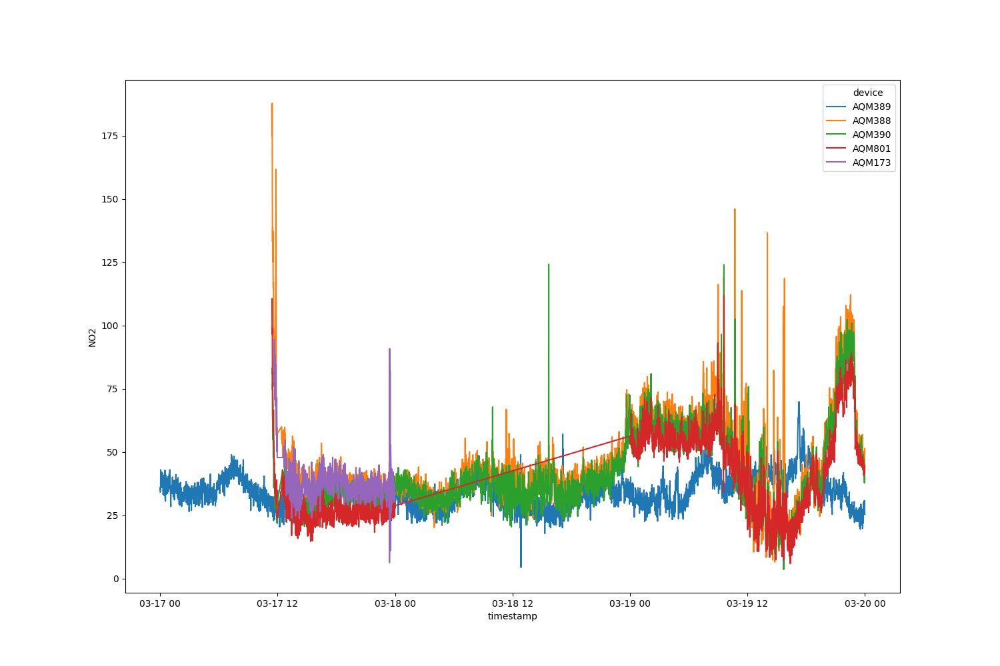

# quant-tools

Tools for working with QUANT data, either directly from the CSV files or from the cleaned database.
Example code is included for loading the data into Python and performing basic analysis.

# Reading data from the database

There is a Postgresql database with the QUANT data (both main study and Wider Participation study) along with relevant reference measurements.
**NB: You must be on the [University Virtual Private Network (VPN)](https://www.york.ac.uk/it-services/services/vpn/) to access the database**
The relevant connection details are:

  - `host`: 'pgwaclquant'
  - `database`: 'waclquant'
  - `user`: 'waclquant_read'
  - `password`: Ask Stuart if you do not have the password

The data is stored in multiple tables that are all related to each other, however, a user friendly interface has been provided that should suit the majority of use cases which collates all the relevant fields into two tables: `lcs` and `ref`.

`lcs` provides all low-cost sensor measurements using the most recent calibration method for each timepoint. I.e. if a calibration algorithm was retrospectively applied so that for some initial time-period there are both out-of-box and calibrated measurements available, this will show only the calibrations.
It has fields:

  - `time`: The timestamp of recording
  - `location`: Where the instrument was located when it made the recording
  - `instrument`: The instrument identifier
  - `measurand`: The pollutant being measured
  - `measurement`: The measurement value itself

If you wish to access all calibration algorithms then use the `measurement` table as detailed below.

`ref` contains reference data and has fields:

  - `time`: The timestamp of recording
  - `location`: Where the instrument was located when it made the recording
  - `measurand`: The pollutant being measured
  - `measurement`: The measurement value itself

If you need further control, or wish to view all the related metadata, then the full list of tables is:

  - `instrument`: A list of all the instruments in the study, where an instrument contains multiple sensors measuring different species
  - `instrumenttype`: Instruments are classified as either LCS or Reference instruments
  - `lcsinstrument`: List of LCS instruments
  - `lcscompany`: List of LCS companies
  - `referenceinstrument`: List of reference instruments. The actual instrument names for anything that isn't in Manchester is a dummy identifier as I did not have access to details of the instruments themselves
  - `deployment`: A list of which instruments were deployed at what sites and when
  - `sensor`: A list of all sensors that are housed in each unit. Each instrument can have multiple sensors for each pollutant
  - `sensorcalibration`: A list of calibration versions for each sensor, so that e.g. for any point in time you can have more than one NO2 measurement from a given sensor, corresponding to different calibration routines
  - `measurand`: A list of all the pollutants measured as part of the study and their units
  - `measurement`: The main table comprising the measurements themselves
  - `flag`: A list of all flagged data, currently implemented only for reference data

## Access from Python

In Python use the `psycopg2` package to connect to the Postgres DB, and then use the `pandas.read_sql` method to pull data directly into Pandas DataFrames.
This requires writing SQL queries, have a look at [https://www.w3schools.com/sql/sql_where.asp](https://www.w3schools.com/sql/sql_where.asp) for possible WHERE filter conditions.

```python
import psycopg2 as pg
import pandas as pd

# Connect to the DB
engine = pg.connect("dbname='waclquant' user='waclquant_read' host='pgwaclquant' password='PASSWORD'")

# Use the pandas.read_sql() method to run queries on the DB.
# Look at https://www.w3schools.com/sql/sql_where.asp for possible WHERE filter conditions
df = pd.read_sql("SELECT * FROM lcs WHERE instrument IN ('AQM389', 'Zep309') AND measurand = 'O3' AND time > '2021-01-01' AND time < '2021-04-01'", engine)
df
```

```python
                      time location instrument measurand  measurement
0      2021-01-01 03:15:00   London     AQM389        O3     12.44100
1      2021-01-01 00:01:00   London     AQM389        O3     11.46300
2      2021-01-01 00:02:00   London     AQM389        O3     11.63800
3      2021-01-01 00:03:00   London     AQM389        O3     13.35300
4      2021-01-01 00:04:00   London     AQM389        O3     11.07600
...                    ...      ...        ...       ...          ...
257531 2021-03-31 21:26:00     York     Zep309        O3      9.88709
257532 2021-03-31 21:27:00     York     Zep309        O3     12.61380
257533 2021-03-31 21:28:00     York     Zep309        O3      9.66161
257534 2021-03-31 21:29:00     York     Zep309        O3      2.37594
257535 2021-03-31 21:30:00     York     Zep309        O3      8.21266

[257536 rows x 5 columns]
```

## Access from R

I would recommend storing the connection details in your `~/.Renviron` file (see [here](https://support.rstudio.com/hc/en-us/articles/360047157094-Managing-R-with-Rprofile-Renviron-Rprofile-site-Renviron-site-rsession-conf-and-repos-conf) for more details) so that you can easily access them in your scripts as follows.

```r
library(tidyverse)
library(DBI)
library(RPostgres)

con <- dbConnect(Postgres(), 
                 host=Sys.getenv("QUANT_DB_HOST"), 
                 dbname=Sys.getenv("QUANT_DB_DBNAME"),
                 user=Sys.getenv("QUANT_DB_USER"),
                 password=Sys.getenv("QUANT_DB_PASSWORD"))
```

You can then access the database and manipulate tables as if they are local data frames using the `dbplyr` package, but the measurements won't be downloaded until you use the `collect` function.

```r
# Obtains the latest calibrations for NO2 for Zep188
# NB: This doesn't actually download the data from the DB
tbl(con, "lcs") |>
    filter(measurand == 'NO2', device == 'Zep188')
```

```r
# Source:   SQL [?? x 5]
# Database: postgres  [waclquant_edit@localhost:/waclquant]
   time                location   instrument measurand measurement
   <dttm>              <chr>      <chr>      <chr>           <dbl>
 1 2019-12-10 14:40:00 Manchester Zep188     NO2             162. 
 2 2019-12-10 14:41:00 Manchester Zep188     NO2              86.6
 3 2019-12-10 14:42:00 Manchester Zep188     NO2              53.9
 4 2019-12-10 14:43:00 Manchester Zep188     NO2              40.3
 5 2019-12-10 14:44:00 Manchester Zep188     NO2              36.9
 6 2019-12-10 14:45:00 Manchester Zep188     NO2              31.9
 7 2019-12-10 14:46:00 Manchester Zep188     NO2              29.0
 8 2019-12-10 14:47:00 Manchester Zep188     NO2              25.9
 9 2019-12-10 14:48:00 Manchester Zep188     NO2              24.2
10 2019-12-10 14:49:00 Manchester Zep188     NO2              24.5
# … with more rows
# ℹ Use `print(n = ...)` to see more rows

```

```r
# Pull the data with collect()
df <- tbl(con, "lcs") |>
    filter(measurand == 'NO2', device == 'Zep188') |>
    select(time, location, instrument, NO2=measurement) |>
    collect()
```

Setting up ODBC connections is very useful as it means you can connect to the database just with `con <- dbConnect(odbc::odbc(), "QUANT")`, where 'QUANT' is the name of a DSN.
Configuring ODBC is beyond the scope of this document as it depends heavily upon Operating System.

# Reading data from CSV

## Installation 

Download `load_data.py` and place it in your working directory or somewhere where it can be imported.

## Example usage

Firstly import the `load_data` function.

```python
from load_data import load_data
```

`load_data` will also import `pandas`, so it doesn't need to be explicitly loaded now.
Also import `seaborn` and `matplotlib` for plotting.

```python
import seaborn as sns
import matplotlib.pyplot as plt
```

The `QUANT/Data/Clean` GoogleDrive folder needs to be available locally, either through Google Drive sync or having been manually downloaded.
Set the `quant_folder` variable to this location, then the `load_data` function can be used.
The default behaviour (`load_data(quant_folder)`) loads all the CSV files in this folder into a single `pandas` data frame, however, there are options to reduce this to certain files of interest.

The `companies` argument allows you to specify which companies' data to load.
It accepts a list with possible values: 'Aeroqual', 'AQMesh', 'Zephyr', and 'QuantAQ'.
The `start` and `end` arguments accept a date in `YYYY-mm-dd` format indicating the earliest and latest (both inclusive) dates to load data from.

The example below will load data from just Aeroqual and AQMesh devices, in the inclusive period 2020-01-01 to 2020-04-28.

```python
quant_folder = "/path/to/folder/Clean"
df = load_data(quant_folder, companies=["Aeroqual", "AQMesh"],
               start="2020-01-01", end="2020-04-28")
df
```

```
                  timestamp manufacturer   device    CO2   NO   NO2    O3  RelHumidity  Temperature
0       2020-01-01 00:00:00       AQMesh   AQM388  419.0 -8.2   6.2  40.5         92.0         7.40
1       2020-01-01 00:00:00       AQMesh   AQM389  448.0 -5.3   4.7  40.6         94.4         7.50
2       2020-01-01 00:00:00       AQMesh   AQM391  424.0 -3.9  10.4  35.0         92.7         7.30
3       2020-01-01 00:00:00       AQMesh   AQM801  430.0 -7.0  11.5   0.0         82.7         7.60
4       2020-01-01 00:00:00     Aeroqual  AQY436A    NaN  NaN  -2.2  35.1         90.6         7.39
...                     ...          ...      ...    ...  ...   ...   ...          ...          ...
1474743 2020-04-28 23:59:00       AQMesh   AQM390    NaN  NaN   NaN   NaN          NaN          NaN
1474744 2020-04-28 23:59:00       AQMesh   AQM391    NaN  NaN   NaN   NaN          NaN          NaN
1474745 2020-04-28 23:59:00     Aeroqual   AQY872    NaN  NaN  -6.2  33.2         99.9         6.72
1474746 2020-04-28 23:59:00     Aeroqual  AQY873A    NaN  NaN  -9.8  39.3         99.9         6.37
1474747 2020-04-28 23:59:00     Aeroqual   AQY874    NaN  NaN -10.5  36.1         95.4         8.11
```

Other options to `load_data` specify what resampling - if any - should be used, and which pollutants to include.
Resampling is controlled by the `resample` argument, which by default is `1Min`.
This value can be changed to any value accepted by [`pandas.resample`](https://pandas.pydata.org/pandas-docs/stable/reference/api/pandas.DataFrame.resample.html), or set to `None` if no resampling is desired.

By default, the following measurands are included in the final data frame:

  - NO
  - NO2
  - O3
  - CO
  - CO2
  - Temperature
  - Relative humidity

However, the `subset` argument can be overwritten to select particular pollutants of interest: `load_data(quant_folder, subset=['NO2', 'O3'])`, or it can be set to `None` to return all possible columns.

Once the data frame has been loaded, it can be queried using [the pandas `query` method](https://pandas.pydata.org/pandas-docs/stable/reference/api/pandas.DataFrame.query.html) to extract specific rows using human readable strings.
The code snippet below shows how to specify a specific manufacturer and a time-frame.
NO2 time-series from this period are then plotted, using the `device` column to colour each device's line.

```
aqmesh_march = df.query("(manufacturer == 'AQMesh') & (timestamp > '2020-03-17') & (timestamp < '2020-03-20')")
plt.figure(figsize=(15,10))
sns.lineplot(data=aqmesh_march, x='timestamp', y='NO2', hue='device');
plt.show()
```



Having the data in this format makes it easy to run basic analyses, such as determining the proportion of missing observations by device.

The code snippet below calculates the proportion of NO2 missingness for our AQMesh and Aeroqual dataset recorded between 2020-01-01 to 2020-04-28, highlighting that our 4 AQM devices all have > 60% missingness. 
This can be explained by the fact that the data is resampled to 1 minute averages, but AQMesh units were recording at 15 min frequencies for much of this period.

This one-line call chains together several operations:

  - [`isnull`](https://pandas.pydata.org/pandas-docs/stable/reference/api/pandas.DataFrame.isnull.html) returns a copy of the data frame with each value replaced by a boolean `True` or `False` indicating whether that value was missing
  - the [`set_index`](https://pandas.pydata.org/pandas-docs/stable/reference/api/pandas.DataFrame.set_index.html) call on the grouping column is required to not include this column in the `isnull` check - we aren't interested in whether a device ID was missing as it should always be present
  - `['NO2']` subsets to just the NO2 column, along with the `device` index
  - [`groupby`](https://pandas.pydata.org/pandas-docs/stable/reference/api/pandas.DataFrame.groupby.html) groups the data frame by each unique `device` ID
  - `mean()` calculates the mean of each `NO2` column per `device` group. In Python, `True` is equivalent to 1, while `False=0`. The mean is therefore calculating the proportion of NO2 missing values that are `True`, i.e. the mean of `[1, 0, 1]` is 0.67.


```python
df.set_index('device').isnull()['NO2'].groupby('device').mean()
```

```
device
AQM173     0.458051
AQM388     0.610810
AQM389     0.628405
AQM390     0.599464
AQM391     0.672171
AQM801     0.489521
AQY436A    0.231568
AQY872     0.003491
AQY873A    0.861775
AQY874     0.002497
AQY875     0.001261
Name: NO2, dtype: float64
```

## Extending this functionality

Both `load_data.py` and the examples shown here are not intended to be the definitive way of using the QUANT data, but instead are merely examples of one way this can be achieved.

Feel free to extend the `load_data` function to better fit your own needs and workflow.
It is fairly straightforward, only opening files and running very basic pre-processing steps (resampling, subsetting columns).
However, one thing to bear in mind is that it is also renaming some columns related to temperature and humidity to ensure that the `Temperature` and `RelHumidity` columns are measuring the same quantity across companies.
In particular, it renames the following measurands from the clean CSV files:

  - Zephyr: `Temperature` becomes `TempPCB`
  - Zephyr: `TempAmb` becomes `Temperature`
  - Zephyr: `RelHumidity` becomes `RelHumPCB`
  - Zephyr: `RelHumAmb` becomes `RelHumidity`
  - QuantAQ: `TempMan` becomes `Temperature`
  - QuantAQ: `RelHumMan` becomes `RelHumidity`

The raw Zephyr data has 2 fields for temperature: `ambTempC` and `tempC`, which the scraper renames to `TempAmb` and `Temperature` respectively.
However, `tempC` actually measures the unit's temperature of the unit, so it has been renamed to `TempPCB`, while `ambTempC` is the value that we are interested in and has thus has been renamed to `Temperature` for consistency.
Likewise for relative humidity.

QuantAQ likewise have 2 temperature measurements: `temp_manifold` and `temp_box`, which the scraper renames to `TempMan` and `TempBox`. 
Similarily, we are interested in the manifold conditions so these column are renamed to `Temperature` and `RelHumidity`.

Ideally, this renaming would be applied in the scraper and retroactively applied to the full dataset.
However, this has not been done to ensure backwards compatibility, although it might be worth adding at some point in the future.

## R implementation

There is also an R version of `load_data`, found in `load_data.R`, with example usage shown in `example.R`.

# Setting up the database

NB: This section details how to recreate the frozen database from the CSV files stored on Google Drive.

The database was created in July 2021 using data from 2019-12-10 to 2021-06-30 from the 5 companies in the main study, from devices situated at Manchester, York, Birmingham and London.
The database also contains reference measurements for these sites.

The schema comprises 2 straight forward wide tables for the measurements (`lcs_raw` and `ref_raw`) and one long table detailing the LCS device deployment histories.
Initially a fully normalised design was employed, but it was found to be slower to query by a factor of 4 than this more naive design.

In addition to these 3 tables are 3 corresponding views that convert datetime fields into human readable datetime objects, rather than the POSIX integers that they are stored as.

The database can be recreated using the files contained in the live `QUANT/Data/Clean` folder, and the various back-ups in `QUANT/Data/One off downloads` using the following steps:

  1. Download the Clean and One off download folders and make them available locally
  2. Run each of the `collate_<company>.R` scripts in `setup-database/1-preprocess-lcs-data`. These scripts collate and clean the multiple datasets per company into a single CSV per company
  3. Run `setup-database/2-populate-db/1_create_schema.sql` in an empty SQLite database to create the relations
  4. Run `setup-database/2-populate-db/2_populate_database.R` to populate the tables
  6. Run `setup-database/2-populate-db/3_create_indexes.sql` from within the database to create indexes to speed up queries. These could be created in `1_create_schema.sql` but that would substantially slow down the data insertion step.
